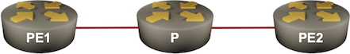

# SRv6/IS-IS with LLA-Only Links

This lab topology describes a lab topology running IS-IS with SRv6 over point-to-point links using IPv6 link-local addresses to minimize the IPv6 routing table size. 

For general instructions on starting labs, connecting to devices, and generating reports with `netlab`, see the [_Using the Labs_](../../docs/use.md) document.
